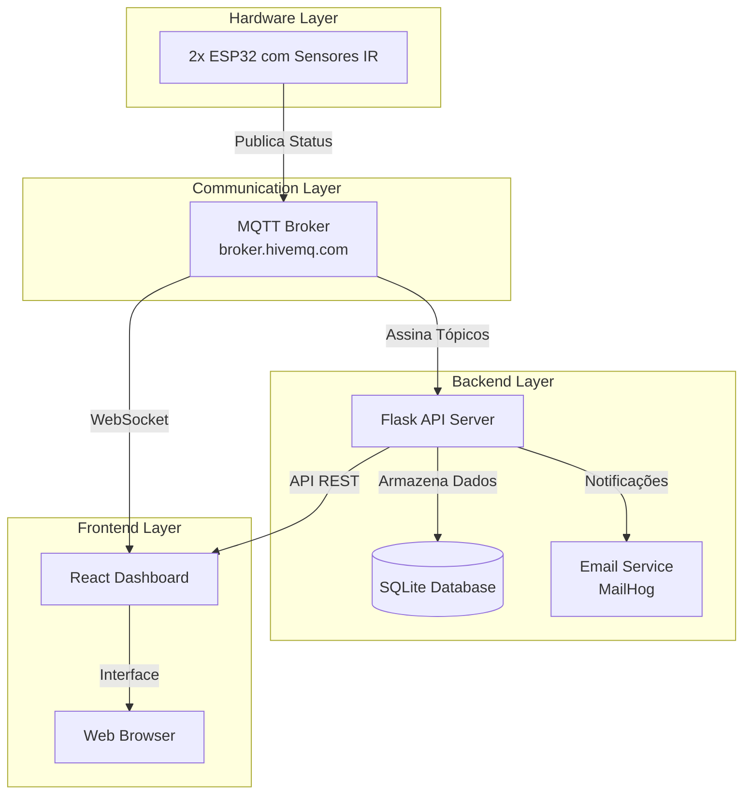

# 🅿️ Smart Parking System

<p align="center">  <a href="#-visão-geral">Visão Geral</a> • <a href="#-funcionalidades">Funcionalidades</a> • <a href="#️-arquitetura">Arquitetura</a> • <a href="#-dashboard">Dashboard</a> • <a href="#-hardware">Hardware</a> • <a href="#️-instalação">Instalação</a> • <a href="#-uso">Uso</a> • <a href="#-estrutura-do-projeto">Estrutura</a> • <a href="#-nossa-equipe">Equipe</a> </p>

<div align="center">
  <div style="display: inline-block; padding: 20px; background: #2d3748; border-radius: 12px; border: 1px solid #4a5568; margin: 20px 0; box-shadow: 0 4px 6px rgba(0,0,0,0.1);">

[](https://github.com/P-E-N-T-E-S/smart-parking)
[](https://www.python.org/)
[](https://reactjs.org/)
[](https://www.espressif.com/)
[](LICENSE)

  </div>
</div>

## 🚀 Visão Geral

O **Smart Parking System** é uma solução completa para monitoramento inteligente de estacionamentos. Utilizando sensores infravermelhos, duas ESP32 com FreeRTOS e comunicação MQTT, o sistema fornece informações em tempo real sobre a disponibilidade de vagas através de um dashboard web moderno e responsivo.

### Principais Características

- **Monitoramento em Tempo Real**: Detecção instantânea de ocupação usando sensores IR
- **Arquitetura Distribuída**: 2x ESP32 (firmware) + Flask (backend) + React (frontend)
- **Comunicação Eficiente**: Protocolo MQTT com broker HiveMQ público
- **Persistência de Dados**: SQLite com histórico completo de ocupação
- **Visualizações Avançadas**: Gráficos, heatmaps e gauges com ApexCharts
- **Design Moderno**: Interface dark theme com sistema de tokens CSS
- **Notificações**: Alertas por email via MailHog
- **Multi-core**: FreeRTOS com tasks concorrentes no ESP32

## 🎯 Funcionalidades

# ✨ Funcionalidades

## 📡 Monitoramento em Tempo Real
- **Detecção inteligente**: Sensores infravermelhos com limiares ajustáveis para detecção precisa de ocupação
- **Comunicação otimizada**: Publicação MQTT somente quando ocorrem mudanças significativas no status
- **Atualização em tempo real**: Sistema dual-channel (MQTT WebSocket + API polling) para máxima confiabilidade
- **Dados em tempo real**: Visualização instantânea da distância medida pelos sensores
- **Status unificado**: Sistema padronizado de status com cores semânticas para fácil interpretação

## 📊 Análise e Visualização de Dados
- **Gauge Radial Interativo**: Visualização em tempo real da porcentagem de vagas disponíveis com gradiente de cores
- **Heatmap de Ocupação**: Análise temporal 7x24 mostrando padrões de ocupação por hora e dia da semana
- **Gráfico Histórico**: Linha do tempo das vagas livres nos últimos 30 minutos para análise de tendências
- **Sparklines por Vaga**: Mini-gráficos individuais mostrando o histórico de cada vaga de estacionamento
- **Dashboard de KPIs**: Painel com métricas-chave atualizadas automaticamente

## ⚙️ Gestão e Controle do Sistema
- **Controle manual**: Alternar manualmente o status das vagas quando necessário
- **Simulador integrado**: Ferramenta para simular ocupação de vagas para testes e demonstrações
- **Sistema de logs**: Registro de eventos com capacidade para até 200 entradas históricas
- **Temporizadores**: Contagem de tempo em cada estado para análise de duração
- **Sistema de notificações**: Alertas configuráveis para eventos importantes do sistema

## 🎨 Interface e Experiência do Usuário
- **Design Dark Theme**: Interface com tema escuro otimizada para uso prolongado
- **Design Responsivo**: Adaptação perfeita para dispositivos móveis, tablets e desktops
- **Animações Fluidas**: Transições suaves e animações para melhor experiência visual
- **Efeito Glassmorphism**: Design moderno com efeito de vidro fosco no cabeçalho
- **Indicadores de Status**: Visualização clara do status de conexão MQTT e API em tempo real

## 🏗️ Arquitetura

### Diagrama do Sistema



### Fluxo de Dados

1. **Sensor IR** detecta distância analógica (GPIO 34)
2. **ESP32** processa leitura e determina ocupação (threshold: 3860)
3. **FreeRTOS Tasks**:
   - Task 1 (Core 0): Leitura contínua do sensor (1s interval)
   - Task 2 (Core 1): Detecção de mudanças (>200 unidades)
4. **MQTT Publicação**: Envia JSON para `/vaga1/status` no broker HiveMQ
5. **Flask Backend**: Recebe mensagem, atualiza banco, envia notificações
6. **React Frontend**: Atualiza dashboard via WebSocket MQTT e API polling

### Componentes Técnicos

#### 🔹 ESP32 Firmware (C++/FreeRTOS)
- **Localização**: `esp32/src/main.cpp`
- **Tarefas**: Duas tasks concorrentes em cores diferentes
- **Comunicação**: WiFi + MQTT com reconexão automática
- **Sincronização**: NTP para timestamp preciso
- **Payload MQTT**:
  ```json
  {
    "situacao": "ocupada",
    "distancia_atual": 3450,
    "diferenca": 210,
    "timestamp": "2024-01-15T14:23:45-03:00"
  }
  ```

#### 🔹 Flask Backend (Python)
- **Localização**: `dashboard/backend/app.py`
- **API REST**: 4 endpoints para gestão de vagas
- **Banco de Dados**: SQLite com migrações automáticas
- **Serviços**: MQTT Subscriber, Email Service, Simulator
- **Dependências**: Flask, paho-mqtt, SQLite3

#### 🔹 React Frontend (JavaScript)
- **Localização**: `dashboard/frontend/`
- **Build Tool**: Vite para desenvolvimento rápido
- **Visualização**: ApexCharts para gráficos avançados
- **Estado**: Gerenciamento dual (MQTT + API polling)
- **Design**: Sistema de tokens CSS com dark theme

## 📊 Dashboard

O dashboard apresenta:

1. **Header**: Logo, título e status do sistema
2. **KPI Cards**: Vagas totais, livres, ocupadas e última atualização
3. **Gauge Central**: Porcentagem visual de vagas livres
4. **Vaga Cards**: Status individual com sparklines e controles
5. **Heatmap**: Análise de ocupação 7x24
6. **Gráfico Temporal**: Histórico de vagas livres
7. **System Status**: Indicadores de conexão MQTT e API

## 🔌 Hardware

### Lista de Componentes

| Componente | Quantidade | Especificações |
|------------|------------|----------------|
| **ESP32 DevKit** | 2x | Dual-core 240MHz, WiFi, 34 GPIOs |
| **Sensor IR Analógico** | 2x | Saída 0-3.3V, alcance ajustável |
| **LED RGB** | 1x | Catodo comum, brilho alto |
| **Resistores 220Ω** | 3x | Para limitar corrente dos LEDs |
| **Protoboard** | 1x | 830 pontos, qualidade média |
| **Jumpers** | 10x+ | Macho-macho e macho-fêmea |
| **Fonte 5V** | 1x | Micro USB ou adaptador |

### Esquema de Conexão

```
ESP32 GPIO 34   → Sensor IR OUT
ESP32 GPIO 27   → LED RGB Vermelho (+220Ω)
ESP32 GPIO 26   → LED RGB Verde (+220Ω)
ESP32 GPIO 25   → LED RGB Azul (+220Ω)
ESP32 GND       → LED RGB Catodo Comum
ESP32 5V        → Sensor IR VCC
Sensor IR GND   → ESP32 GND
```

### Pinagem Detalhada

| Pino ESP32 | Função | Componente | Notas |
|------------|--------|------------|-------|
| GPIO 34 | Entrada Analógica | Sensor IR OUT | ADC1_CH6, apenas entrada |
| GPIO 27 | Saída Digital | LED Vermelho | PWM capaz, 220Ω resistor |
| GPIO 26 | Saída Digital | LED Verde | PWM capaz, 220Ω resistor |
| GPIO 25 | Saída Digital | LED Azul | PWM capaz, 220Ω resistor |
| 5V | Alimentação | Sensor IR VCC | 5V regulado |
| GND | Terra | Todos componentes | Ponto comum de terra |

### Lógica de Funcionamento do Hardware

Cada uma das **duas ESP32** opera da seguinte forma:

1. **Sensor IR**: Emite infravermelho e mede reflexão
2. **Leitura Analógica**: Valores de 0-4095 (12-bit ADC)
3. **Threshold**: 
   - < 3860: Vaga ocupada (LED vermelho)
   - ≥ 3860: Vaga livre (LED verde)
4. **Mudança Drástica**: Publicação MQTT somente quando Δ > 200
5. **LED Feedback**: Indicação visual local do status

## ⚙️ Instalação

### Pré-requisitos

- **Python 3.12+** com pip
- **Node.js 18+** com npm
- **PlatformIO** (para firmware ESP32)
- **Git** para clonar repositório
- **Docker** (opcional, para MailHog)

### 1. Clonar o Repositório

```bash
git clone https://github.com/P-E-N-T-E-S/smart-parking.git
cd smart-parking
```

### 2. Configurar Backend (Flask)

```bash
# Navegar para diretório do backend
cd dashboard/backend

# Criar ambiente virtual
python -m venv venv

# Ativar ambiente virtual
# Linux/Mac:
source venv/bin/activate
# Windows:
venv\Scripts\activate

# Instalar dependências
pip install -r requirements.txt

# Configurar variáveis de ambiente (opcional)
cp .env.example .env
# Editar .env com suas configurações

# Iniciar servidor
python app.py
```

### 3. Configurar Frontend (React)

```bash
# Navegar para diretório do frontend
cd dashboard/frontend

# Instalar dependências
npm install

# Configurar ambiente (opcional)
cp .env.example .env.local
# Editar .env.local se necessário

# Iniciar servidor de desenvolvimento
npm run dev
```

### 4. Configurar Firmware ESP32

```bash
# Navegar para diretório do firmware
cd ../../esp32

# Abrir no VSCode com PlatformIO
# Ou usar CLI:

# Configurar credenciais WiFi
# Editar src/main.cpp:
# const char* ssid = "SEU_WIFI";
# const char* password = "SUA_SENHA";

# Compilar e enviar
pio run -t upload

# Monitorar serial
pio device monitor
```

### 5. Configurar MailHog (Opcional)

```bash
# Usando Docker
docker run -d --name mailhog -p 1025:1025 -p 8025:8025 mailhog/mailhog

# Interface web disponível em:
# http://localhost:8025
```

## 🚀 Uso

### Inicialização do Sistema

1. **Iniciar MailHog** (opcional):
   ```bash
   docker start mailhog
   ```

2. **Iniciar Backend**:
   ```bash
   cd dashboard/backend
   source venv/bin/activate
   python app.py
   ```

3. **Iniciar Frontend**:
   ```bash
   cd ../frontend
   npm run dev
   ```

4. **Alimentar ESP32**:
   - Conectar via USB ou fonte 5V
   - Verificar LED indicador

### Acessando o Sistema

- **Dashboard**: http://localhost:5174
- **API Backend**: http://localhost:5000
- **API Endpoints**: 
  - `GET /api/spots` - Listar vagas
  - `POST /api/spots/toggle` - Alternar status
  - `GET /api/status` - Status do sistema
  - `POST /api/simulator/control` - Controlar simulador

- **MailHog Interface**: http://localhost:8025 (se instalado)

### Testando Funcionalidades

1. **Simulador de Vaga**:
   ```bash
   curl -X POST http://localhost:5000/api/simulator/control \
     -H "Content-Type: application/json" \
     -d '{"action": "start"}'
   ```

2. **Toggle Manual**:
   ```bash
   curl -X POST http://localhost:5000/api/spots/toggle \
     -H "Content-Type: application/json" \
     -d '{"spot": 2}'
   ```

3. **Verificar Status**:
   ```bash
   curl http://localhost:5000/api/status
   ```

## 📁 Estrutura do Projeto

```
smart-parking/
├── esp32/                      # Firmware ESP32
│   ├── src/
│   │   ├── main.cpp           # Código principal FreeRTOS
│   │   └── config.h           # Configurações (WiFi, MQTT, thresholds)
│   ├── lib/                   # Bibliotecas personalizadas
│   ├── test/                  # Testes do firmware
│   ├── platformio.ini         # Configuração PlatformIO
│   └── README.md              # Documentação específica do firmware
│
├── dashboard/
│   ├── backend/               # Flask API
│   │   ├── app.py            # Aplicação Flask principal
│   │   ├── mqtt_client.py    # Cliente MQTT assíncrono
│   │   ├── database.py       # Modelos e operações do banco
│   │   ├── email_service.py  # Serviço de notificações
│   │   ├── simulator.py      # Simulador de vagas
│   │   ├── api/              # Blueprints e endpoints
│   │   │   ├── __init__.py
│   │   │   ├── spots.py      # Endpoints de vagas
│   │   │   └── system.py     # Endpoints do sistema
│   │   ├── models/           # Modelos de dados
│   │   ├── utils/            # Utilitários
│   │   ├── tests/            # Testes do backend
│   │   ├── requirements.txt  # Dependências Python
│   │   ├── requirements-dev.txt # Dependências de desenvolvimento
│   │   └── .env.example      # Template de variáveis de ambiente
│   │
│   └── frontend/             # React Dashboard
│       ├── src/
│       │   ├── App.jsx       # Componente raiz
│       │   ├── main.jsx      # Ponto de entrada
│       │   ├── assets/       # Imagens, fonts, etc.
│       │   ├── components/   # Componentes React
│       │   │   ├── common/   # Componentes reutilizáveis
│       │   │   ├── dashboard/ # Componentes do dashboard
│       │   │   └── layout/   # Componentes de layout
│       │   ├── hooks/        # Custom hooks
│       │   ├── services/     # Serviços (API, MQTT)
│       │   ├── contexts/     # Contextos React
│       │   ├── utils/        # Funções utilitárias
│       │   ├── styles/       # Estilos CSS
│       │   └── tests/        # Testes do frontend
│       ├── public/           # Arquivos estáticos
│       ├── package.json      # Dependências npm
│       ├── vite.config.js    # Configuração Vite
│       ├── eslint.config.js  # Configuração ESLint
│       └── .env.example      # Template de variáveis de ambiente
│
├── docs/                      # Documentação adicional
│   ├── api/                  # Documentação da API
│   ├── hardware/             # Diagramas e esquemas
│   └── screenshots/          # Capturas de tela
│
├── scripts/                  # Scripts auxiliares
│   ├── deploy/              # Scripts de deploy
│   ├── backup/              # Scripts de backup
│   └── monitoring/          # Scripts de monitoramento
│
├── docker/                   # Configurações Docker
│   ├── Dockerfile.backend   # Imagem do backend
│   ├── Dockerfile.frontend  # Imagem do frontend
│   └── docker-compose.yml   # Orquestração completa
│
├── .github/                  # Configurações GitHub
│   ├── workflows/           # GitHub Actions
│   └── ISSUE_TEMPLATE/      # Templates de issues
│
├── .gitignore               # Arquivos ignorados pelo git
├── LICENSE                  # Licença do projeto
├── README.md                # Este arquivo
└── CHANGELOG.md             # Histórico de mudanças
```

## 🤝 Contribuição

Contribuições são bem-vindas! Siga estes passos:

1. **Fork o projeto**
2. **Crie uma branch** para sua feature:
   ```bash
   git checkout -b feature/nova-feature
   ```
3. **Commit suas mudanças**:
   ```bash
   git commit -m 'Adiciona nova feature'
   ```
4. **Push para a branch**:
   ```bash
   git push origin feature/nova-feature
   ```
5. **Abra um Pull Request**

### Diretrizes de Contribuição

- Siga o padrão de código existente
- Adicione testes para novas funcionalidades
- Atualize a documentação conforme necessário
- Use mensagens de commit claras e descritivas

### Ambiente de Desenvolvimento

```bash
# Configurar ambiente completo
make setup-dev  # Ou ./scripts/setup-dev.sh

# Executar todos os testes
make test-all

# Iniciar todos os serviços
make start-all
```


## 📖 Apresentação (Pitch Deck)

Para entender a **visão, o problema e a solução** do projeto em detalhes, confira os slides do nosso pitch:

**[Acesse os Slides Aqui](https://www.canva.com/design/DAG6dKz116Q/OVDjpJOEK3ug18rp1E3CsQ/edit?utm_content=DAG6dKz116Q&utm_campaign=designshare&utm_medium=link2&utm_source=sharebutton)** 

---

## 📄 Relatório Técnico

Para uma visão completa da documentação técnica, arquitetura detalhada e análise do sistema, acesse nosso relatório:

**[📥 Baixar Relatório (PDF)](relatorio/Smart-Parking.pdf)**

---

## 👥 Nossa Equipe

<div align="center">

| [<br>Thomaz Lima](https://github.com/Thomazrlima) | [<br>Evaldo Filho](https://github.com/evaldocunhaf) | [<br>Pedro Silva](https://github.com/hsspedro) | [<br>Sofia Saraiva](https://github.com/Sofia-Saraiva) |
| :--------------------------------------------------------------------------------------------------------------------------------------------------: | :-----------------------------------------------------------------------------------------------------------------------------------------------------: | :---------------------------------------------------------------------------------------------------------------------------------------------: | :--------------------------------------------------------------------------------------------------------------------------------------------------------: |
|                                                                  Frontend Developer                                                                   |                                                                Especialista em Hardware                                                                 |                                                                Desenvolvedor IoT                                                                |                                                                     Backend Developer                                                                     |

</div>

